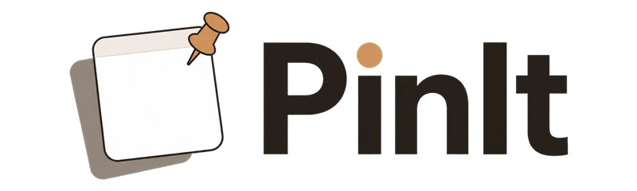
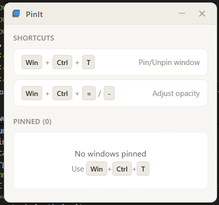

<p align="center">
  <picture>
    <source media="(prefers-color-scheme: dark)" srcset="docs/assets/wordmark-dark.png">
    
  </picture>
</p>

<p align="center">
  <b>Keep any window always on top on Windows 11 & 10 — instantly, with a global hotkey.</b>
</p>

<p align="center">
  <a href="https://github.com/Razee4315/Pin-It/releases/latest"></a>
  <a href="https://github.com/Razee4315/Pin-It/releases"></a>
  <a href="https://github.com/Razee4315/Pin-It/releases/latest"></a>
  <a href="https://tauri.app"></a>
  <a href="LICENSE"></a>
</p>

Press `Win+Ctrl+T` and the focused window stays on top of everything else. Slide its opacity down to see through it. Restart your PC and PinIt re-pins it automatically. A single-purpose, ~2.5 MB alternative to installing a whole utility suite — built with Rust and Tauri for native performance.

<!-- TODO: replace with Screenshot/demo.gif — a 5-10s recording of pinning a window + adjusting opacity converts far better than a static image -->
<p align="center">
  
  <br>
  <em>Pin, fade, and manage windows from one tiny panel</em>
</p>

## Download

**[⬇ Download the latest release](https://github.com/Razee4315/Pin-It/releases/latest)** — Windows 10 & 11, free.

| File | What it is |
|------|------------|
| `PinIt_x.y.z_x64-setup.exe` | NSIS installer (recommended, ~2.5 MB) |
| `PinIt_x.y.z_x64_en-US.msi` | MSI installer (for enterprise / Group Policy deployment) |

> **Note:** The installers are not yet code-signed, so Windows SmartScreen may show "Windows protected your PC". Click **More info → Run anyway**. PinIt is fully open source (Apache 2.0) — audit the code or build it yourself from this repository.

## Features

- **Global hotkey pinning** — `Win+Ctrl+T` pins/unpins the focused window. No clicking through menus.
- **Per-window transparency** — make any pinned window see-through with `Win+Ctrl+=` / `Win+Ctrl+-` or a slider. Great for reference docs, video calls, or notes over your work.
- **Pins survive restarts** — PinIt remembers what you pinned (and its opacity) and re-pins it when you log back in.
- **Windows 11 topmost re-enforcement** — Win11's compositor sometimes strips the always-on-top flag; PinIt watches window events and re-applies it automatically.
- **Customizable shortcuts** — rebind every hotkey from the app.
- **System tray app** — closes to the tray and stays out of your way. Optional start-with-Windows.
- **Tiny and fast** — Rust backend talking directly to the Windows API. ~2.5 MB installer, minimal RAM.

## Keyboard Shortcuts

| Action | Default shortcut |
|--------|------------------|
| Pin / unpin focused window | `Win` + `Ctrl` + `T` |
| Increase opacity | `Win` + `Ctrl` + `=` |
| Decrease opacity | `Win` + `Ctrl` + `-` |
| Show / hide PinIt | `Win` + `Ctrl` + `P` |

All shortcuts can be customized from within the app.

## How PinIt compares

| | PinIt | PowerToys (Always On Top) | DeskPins |
|---|:---:|:---:|:---:|
| Free | ✅ | ✅ | ✅ |
| Single-purpose, lightweight | ✅ ~2.5 MB | ❌ full utility suite | ✅ |
| Global hotkey to pin | ✅ | ✅ | ✅ |
| True per-window transparency | ✅ | ❌ ¹ | ❌ |
| Pins persist across restarts | ✅ | ❌ | ❌ |
| Actively maintained | ✅ | ✅ | ❌ (last release 2018) |

¹ PowerToys' "Opacity" setting changes the highlight *border* around pinned windows, not the window content itself — true window transparency is a long-standing open feature request ([#26049](https://github.com/microsoft/PowerToys/issues/26049)).

## FAQ

### How do I keep a window always on top in Windows 11?

Windows has no built-in always-on-top button. Install PinIt, click the window you want to keep visible, and press `Win+Ctrl+T` — it stays on top of every other window until you unpin it.

### What is the keyboard shortcut to pin a window on top?

PinIt's default is `Win+Ctrl+T` to toggle pinning. You can rebind it (and the opacity shortcuts) from the app.

### Can I make a window transparent / see-through on Windows?

Yes — pin a window with PinIt, then press `Win+Ctrl+-` to fade it (down to 20% opacity) or `Win+Ctrl+=` to make it solid again. Each pinned window keeps its own opacity level.

### Do my pinned windows stay on top after I restart?

Yes. PinIt saves your pins (per app, with their opacity) to `%LOCALAPPDATA%\PinIt` and re-pins matching windows on the next launch — something neither PowerToys nor DeskPins does.

### PowerToys already has Always On Top — why PinIt?

Two things PowerToys can't do: true per-window transparency and pins that survive a reboot. Plus, PinIt is a single ~2.5 MB tool rather than a large suite — if pinning is all you need, you don't have to install everything else.

### Does it work with apps running as administrator?

Windows security (UIPI) prevents normal apps from modifying elevated windows. To pin a window that's running as administrator, run PinIt as administrator too.

### Is PinIt free and open source?

Yes — PinIt is completely free and open source under the [Apache 2.0 license](LICENSE). Use it, modify it, and redistribute it, including commercially.

## Development

### Prerequisites

- [Node.js](https://nodejs.org/) (v18+)
- [Bun](https://bun.sh/) (recommended) or npm
- [Rust](https://www.rust-lang.org/tools/install)

### Setup

```bash
# Clone the repository
git clone https://github.com/Razee4315/Pin-It.git
cd Pin-It

# Install dependencies
bun install

# Run in development mode
bun run tauri dev

# Build for production
bun run tauri build
```

## Why PinIt?

As a developer moving between Linux and Windows, I always missed the native ability to keep any window on top. While Linux desktop environments often have this built-in, Windows options were limited.

The most common solution, Microsoft PowerToys, comes bundled with dozens of other utilities I didn't need. I wanted a lightweight, singular-purpose tool that does one thing and does it well — without the bloat. PinIt was born from the desire for a clean, simple, and resource-efficient alternative that feels like a native part of the system.

## Tech Stack

- **Frontend**: React, TypeScript, Vite
- **Backend**: Rust, Tauri v2 (direct Windows API)
- **Build**: Bun

## License

PinIt is open source under the **[Apache License 2.0](LICENSE)** — free to use, modify, and redistribute, including for commercial purposes.

## Author

**Saqlain Abbas**
Email: saqlainrazee@gmail.com

GitHub: [@Razee4315](https://github.com/Razee4315)
